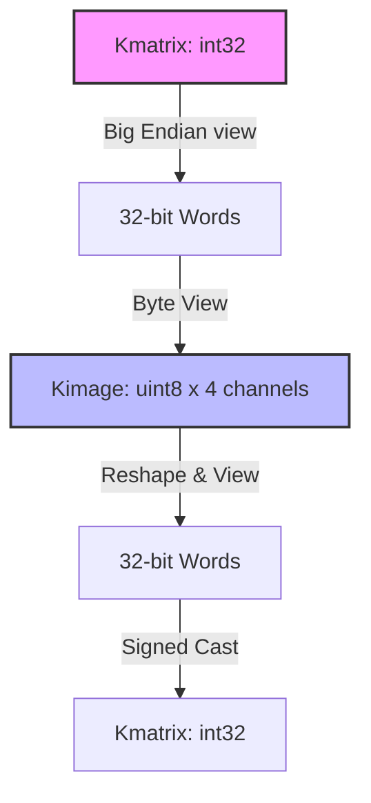

# 🌌 Kine Library

<p align="left">
  
  
  
  
</p>

A high-performance Python library for motion state representation, vectorized accumulation, and lossless image-based serialization of multi-DOF (Degrees of Freedom) systems.

---

## 📋 Table of Contents
- [🌌 Overview](#-overview)
- [🔬 Technical Specifications & Mathematical Formulations](#-technical-specifications--mathematical-formulations)
  - [1.1 Serialization Mapping (Kmatrix $\leftrightarrow$ Kimage)](#11-serialization-mapping-kmatrix--kimage)
  - [1.2 Vectorized Accumulator Update Mechanics](#12-vectorized-accumulator-update-mechanics)
  - [1.3 State Sign Evaluation](#13-state-sign-evaluation)
- [🛠️ API Reference](#️-api-reference)
  - [2.1 Data Container Classes](#21-data-container-classes)
  - [2.2 Core Functions](#22-core-functions)
- [⚙️ Run & Verify](#️-run--verify)
  - [3.1 Running the Verification Demo](#31-running-the-verification-demo)
- [📄 License](#-license)

---

## 🌌 Overview

The **Kine Library** provides low-overhead, memory-efficient data structures and vectorized operations for handling motion datasets. The library operates primarily on four custom containers, mapping raw multi-dimensional arrays to specialized semantics using NumPy memory views.



---

## 🔬 Technical Specifications & Mathematical Formulations

### 1.1 Serialization Mapping (Kmatrix $\leftrightarrow$ Kimage)

A motion sequence is represented as a `Kmatrix` $M \in \mathbb{Z}^{R \times C}$ (where $R$ is the frame count and $C$ is the number of degrees of freedom).

To serialize this sequence into a lossless image-based format, the library maps $M$ to a `Kimage` $I \in \mathbb{U}^{R \times C \times 4}$. Each 32-bit signed integer $M_{i,j}$ is cast to big-endian (`>i4`) representation and decomposed into four 8-bit unsigned channels ($R, G, B, A$):

$$I_{i,j,0} = (M_{i,j} \gg 24) \pmod{256}$$

$$I_{i,j,1} = (M_{i,j} \gg 16) \pmod{256}$$

$$I_{i,j,2} = (M_{i,j} \gg 8) \pmod{256}$$

$$I_{i,j,3} = M_{i,j} \pmod{256}$$

Decoding reads the `Kimage` $I$ by reshaping and viewing the contiguous byte stream as big-endian 32-bit signed integers:

$$M_{i,j} = \text{view\_as\_int32}\left( \text{big\_endian\_uint32}(I_{i,j,0..3}) \right)$$

> [!NOTE]
> This mapping allows standard image manipulation pipelines and storage formats to act as a lossless transport layer for coordinate data.

### 1.2 Vectorized Accumulator Update Mechanics

For a character model `Karacter` with $C$ degrees of freedom, the motion state is represented by an unsigned 32-bit state accumulator $nacc \in \mathbb{U}_{32}^C$ and its historical frame state $oacc \in \mathbb{U}_{32}^C$.

When applying a frame displacement $F \in \mathbb{Z}^C$ (`Kframe`), the transition updates the historical state and performs vectorized modular addition:

$$oacc_k \leftarrow nacc_k \quad \forall k \in \{1, \dots, C\}$$
$$nacc_k \leftarrow \left( nacc_k + \mathrm{view\_as\_uint32}(F_k) \right) \pmod{2^{32}}$$

> [!WARNING]
> The mathematical conversion from `int32` to `uint32` during `update()` uses bitwise casting (`view(np.uint32)`). Modulo-32 arithmetic behaves as unsigned overflow addition.

### 1.3 State Sign Evaluation

The sign state indicator $sacc \in \{\text{True}, \text{False}\}^C$ records the direction of the transition. The difference is calculated in signed 32-bit representation:

$$diff_k = \mathrm{view\_as\_int32}\left( nacc_k - oacc_k \right)$$
$$sacc_k = \begin{cases} \text{True} & \text{if } diff_k \ge 0 \\ \text{False} & \text{if } diff_k < 0 \end{cases}$$
---

## 🛠️ API Reference

### 2.1 Data Container Classes

#### 📦 `Karacter(dof: int, name: str = "Unnamed Karacter")`

Maintains the accumulator states for a system.

* **Attributes**:
| Attribute | Type | Description |
| --- | --- | --- |
| `model_name` | `str` | Unique identifier. |
| `dof_count` | `np.uint16` | Total degrees of freedom ($C \le 65535$). |
| `nacc` | `np.ndarray` (uint32) | Current accumulator state. |
| `oacc` | `np.ndarray` (uint32) | Historical state. |
| `sacc` | `np.ndarray` (bool) | Step sign flags. |


* **Methods**:
* `clear()`: Fills `nacc` and `oacc` with `0`, and resets `sacc` to `False`.


#### 📦 `Kframe(dof: int)`

Extends `np.ndarray`. Represents a single frame containing 32-bit signed integer offsets.

* **Attributes**:
| Attribute | Type | Description |
| --- | --- | --- |
| `dof_count` | `np.uint16` | Active degree of freedom count. |


#### 📦 `Kmatrix(row: int, column: int)`

Container representing an uncompressed motion sequence.

* **Attributes**:
| Attribute | Type | Description |
| --- | --- | --- |
| `row` | `np.uint16` | Total frames. |
| `column` | `np.uint16` | Degree of freedom count. |
| `kmatrix` | `np.ndarray` (int32) | C-order contiguous 2D array of shape `(row, column)`. |


#### 📦 `Kimage(row: int, column: int)`

Container for serialized motion data.

* **Attributes**:
| Attribute | Type | Description |
| --- | --- | --- |
| `row` | `np.uint16` | Image height (frames). |
| `column` | `np.uint16` | Image width (DOFs). |
| `kimage` | `np.ndarray` (uint8) | C-order contiguous 3D array of shape `(row, column, 4)`. |


---

### 2.2 Core Functions

| Function Signature | Input Parameters | Returns | Description |
| --- | --- | --- | --- |
| `create(kind, *args, **kwargs)` | `kind`: Class type<br>

<br>`*args`, `**kwargs`: Constructor args | `object` | Factory instantiator for `Karacter`, `Kframe`, `Kimage`, and `Kmatrix`. |
| `clear(obj)` | `obj`: Custom container | `None` | In-place zero-fill operation supporting all custom Kine containers. |
| `encode(kmatrix)` | `kmatrix`: `Kmatrix` | `Kimage` | Converts coordinate sequences to packed byte pixels. |
| `decode(kimage)` | `kimage`: `Kimage` | `Kmatrix` | Reverses the byte-packing serialization to return the original signed integer matrix. |
| `flow(index, source)` | `index`: `np.uint16`<br>

<br>`source`: `Kmatrix | Kimage` | `Kframe` | Extracts and returns the `Kframe` at `index` from the source. |
| `update(karacter, kframe)` | `karacter`: `Karacter`<br>

<br>`kframe`: `Kframe` | `None` | Propagates state. Stores `nacc` to `oacc` and increments `nacc` by `kframe` offsets. |
| `sign(karacter)` | `karacter`: `Karacter` | `None` | Evaluates the directional transition of accumulator states and updates `karacter.sacc`. |
| `state(karacter)` | `karacter`: `Karacter` | `np.ndarray` | Returns a copy of the current state accumulator `karacter.nacc`. |

---

## ⚙️ Run & Verify

### 3.1 Running the Verification Demo

The library includes a self-contained validation module. To run the lossless round-trip serialization and state accumulation demo:

```bash
python -m demo.Ex-001

```

#### Demo Implementation details:

```python
import numpy as np
from core.classes.karacter import Karacter
from core.classes.kmatrix import Kmatrix
from core.functions.create import create
from core.functions.flow import flow
from core.functions.encode import encode
from core.functions.decode import decode
from core.functions.update import update
from core.functions.sign import sign
from core.functions.state import state
from core.functions.clear import clear

def main():
    DOF = 6
    FRAMES = 4

    # 1. Instantiate state accumulator rig
    karacter = create(Karacter, dof=DOF, name="Rig01")

    # 2. Instantiate and fill motion sequence matrix
    kmatrix = create(Kmatrix, row=FRAMES, column=DOF)
    sample_motion = np.array([
        [10, -5, 0, 3, -1000, 7],
        [-3, 8, 1200, 0, 4, -99999],
        [2**31 - 1, -2**31, 0, 42, -42, 0],
        [1, 1, 1, 1, 1, 1],
    ], dtype=np.int32)
    kmatrix.kmatrix[:] = sample_motion

    # 3. Lossless encoding to image format
    kimage = encode(kmatrix)
    print(f"Encoded {kmatrix} to {kimage}")

    # 4. Verification of lossless serialization
    decoded = decode(kimage)
    assert np.array_equal(kmatrix.kmatrix, decoded.kmatrix), "Data mismatch during round-trip"
    print("Round-trip validation: Successful")

    # 5. Incremental motion state update loop
    for i in range(FRAMES):
        frame = flow(np.uint16(i), kmatrix)
        update(karacter, frame)
        sign(karacter)

    print("Accumulator (nacc):", state(karacter))
    print("Sign Flags  (sacc):", karacter.sacc)

    # 6. Memory cleanup
    clear(karacter)
    clear(kmatrix)
    clear(kimage)

if __name__ == "__main__":
    main()

```

---

## 📄 License

This project is licensed under the **Mozilla Public License 2.0 (MPL 2.0)**. See the `LICENSE` file for details or review the terms at [https://www.mozilla.org/en-US/MPL/2.0/](https://www.mozilla.org/en-US/MPL/2.0/).

```

```
